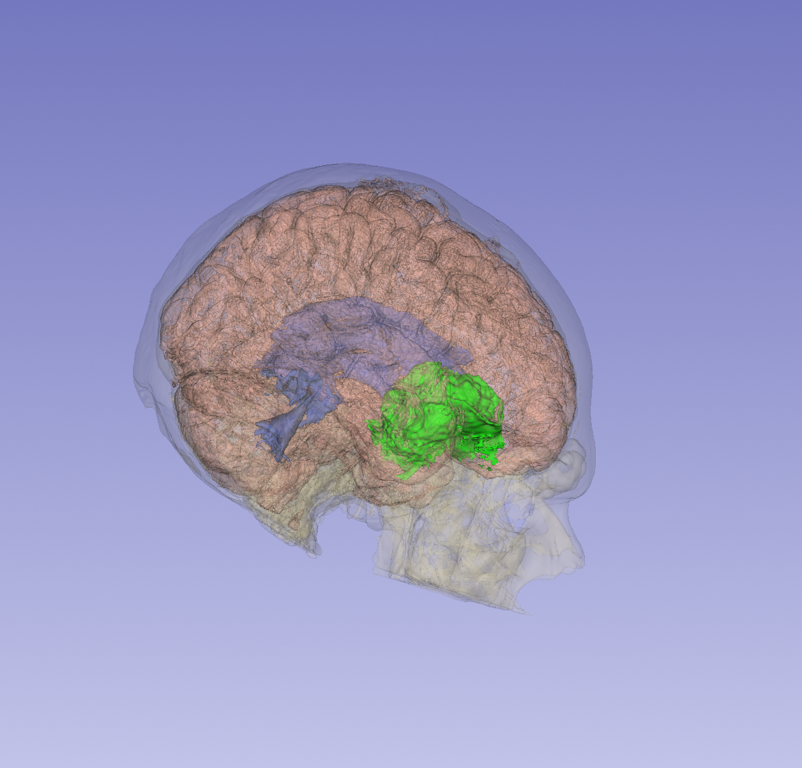
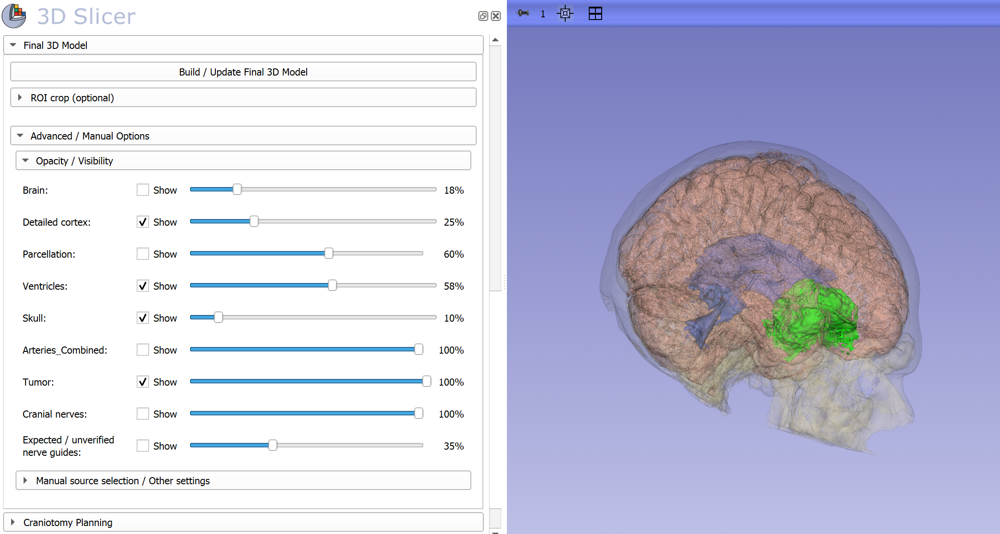

# NeurosurgicalPlanning

*Conceptual artwork for the extension identity; not an anatomical reference or a screenshot of software-generated patient results.*

**NeurosurgicalPlanning** is a 3D Slicer extension for multimodal preoperative neurosurgical planning.  
The extension currently contains the internal Slicer module **SurgicalPlanning**.

The project is designed to support integrated review and reconstruction of multimodal neuroimaging for surgical planning workflows, including registration, cranial and brain surface preparation, tumor and edema segmentation workflows, vascular reconstruction, cortical/parcellation workflows, and final 3D planning views.

## 3D planning example

*Illustrative, de-identified 3D reconstruction showing a cortical surface, ventricles, tumor segmentation, and transparent cranial anatomy. This screenshot demonstrates visualization functionality; it is not evidence of segmentation accuracy or clinical validation.*

## Current validated baseline

The current validated baseline is **v0.6.84**.

Testing completed on:

- 3D Slicer 5.12.0
- 3D Slicer 5.12.4
- 3D Slicer 5.13 Preview
- External tester installation and workflow testing

The public repository is being prepared for submission to the 3D Slicer Extensions Index.

## Extension and module names

- Public extension name: `NeurosurgicalPlanning`
- Internal Slicer module: `SurgicalPlanning`
- Repository: `giakoum/SlicerNeurosurgicalPlanning`

The internal module name is intentionally retained for compatibility with the validated codebase.

## Included module

**SurgicalPlanning** provides an integrated 3D Slicer workspace for MRI/CT registration, cranial and intracranial surface preparation, tumor and edema segmentation, arterial visualization, cortical and atlas-based planning, and interactive 3D review. Specific advanced workflows require optional extensions; see [DEPENDENCIES.md](DEPENDENCIES.md).

### SurgicalPlanning interface

*Final 3D Model workflow in 3D Slicer, with per-structure visibility and opacity controls. The displayed example does not include arterial reconstruction.*

The [extension icon](Documentation/Images/NeurosurgicalPlanning_Icon_Final.png) is provided separately from these real Slicer workflow screenshots. Build verification and the remaining submission work are tracked in the [submission checklist](docs/EXTENSION_SUBMISSION.md).

## Author

**Dimitrios Giakoumettis, MD, MSc, PhD, FEBNS**  
Department of Neurosurgery, “Saint Savvas” Oncological Hospital, Athens, Greece

Module author metadata: **Dimitrios Giakoumettis, MD, PhD**

### Independent development and institutional affiliation

NeurosurgicalPlanning was independently developed by Dimitrios Giakoumettis on his own initiative and personal time, without an institutional assignment, funding, or development involvement from “Saint Savvas” Oncological Hospital. The hospital affiliation above identifies the author's professional appointment only and does not imply institutional authorship, ownership, sponsorship, endorsement, or clinical approval of the software.

## Installation

The source of the validated **v0.6.84** module is available under [`SurgicalPlanning/`](SurgicalPlanning/).

For development and testing, clone or download this repository and add the local `SurgicalPlanning` directory to 3D Slicer's **Edit → Application Settings → Modules → Additional module paths**, then restart Slicer. An Extensions Manager installation will only become available after successful build, review, and acceptance into the official 3D Slicer Extensions Index.

**Release status:** The repository contains the validated source and initial CMake packaging, but clean-install packaging and automated build checks are still pending. No official GitHub Release or Zenodo DOI has been published yet.

## Clinical and research use

This software is provided as a planning and research tool. It does not replace clinical judgment, institutional validation, or applicable regulatory requirements. Users are responsible for independently verifying outputs before clinical use.

## License

Licensed under the **Apache License 2.0**. See [LICENSE](LICENSE).

## Versioning

The validated public baseline begins at **v0.6.84**. Future public releases will be tagged in this repository.
